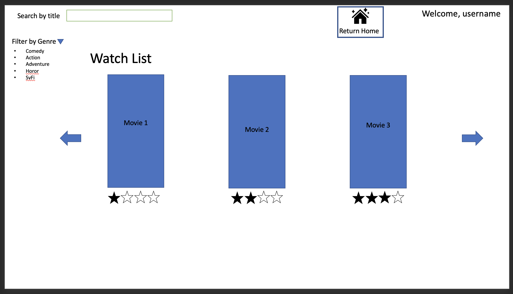
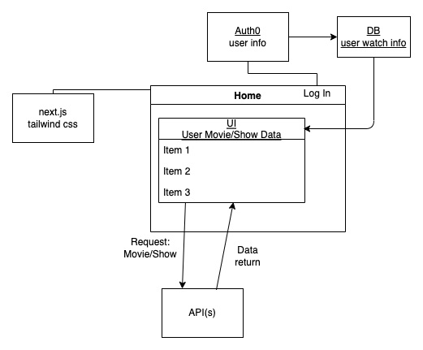
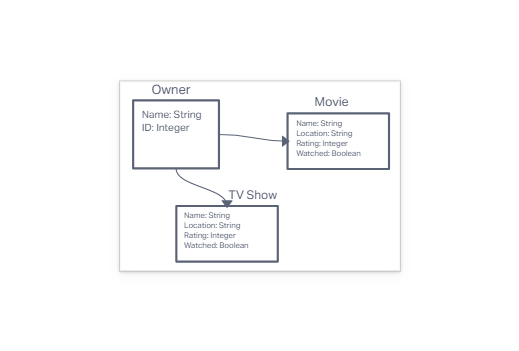

# Project: Josh's Idea

## Summary

- One stop shop to find where your entertainment is located and save your custom watch-lists

## Team Members

- **Chris**
- **Ian**
- **Clarissa**
- **Bionca**
- **Joshua**

### Install

> npm i
or
> yarn install

### Development

> npm run dev
or
> yarn dev

Dev server on port 3000

## Wireframe

## User Stories

- [User Stories](https://docs.google.com/document/d/1KaQX4GVIE1Wr3k9m2sp0IgihGZuwVdxQnjBeYotQoS8/edit)

## Domain Modeling

## DB Schema

